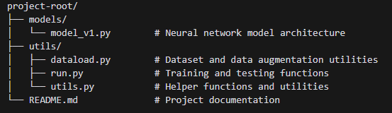
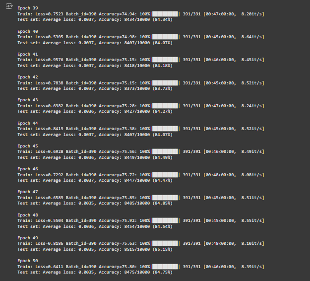

# ERAV3_PP_S7_MNISTAWS
Model training on CIFAR 10 dataset.

## Target:
Achieve 85% accuracy with less than 200k parameters
No limit on the number of epochs
Architecture to be followed is given: C1C2C3C40 (No MaxPooling, but 3 3x3 layers with stride of 2 instead) 
total RF must be more than 44
### Additional considerations:
 1. one of the layers must use Depthwise Separable Convolution
 2. one of the layers must use Dilated Convolution
 3. use GAP (compulsory):- add FC after GAP to target #of classes (optional)
 4. use augmentation library and apply:
    - horizontal flip
    - shiftScaleRotate
    - coarseDropout (max_holes = 1, max_height=16px, max_width=1, min_holes = 1, min_height=16px, min_width=16px, fill_value=(mean of your dataset), mask_fill_value = None)

## Project Structure

## Model Architecture:

## Model Training logs:
Last 10-12 epochs logs have been attached below:
Model is above 84% test accuracy post Epoch # 39 and hits the target accuracy above i.e. 85.15% in Epoch # 49

